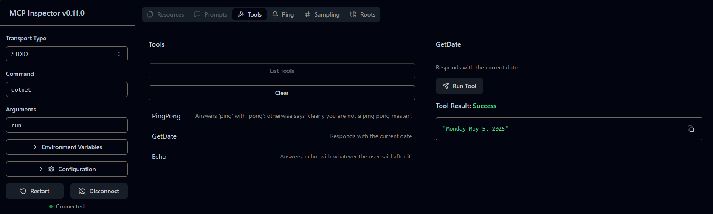

# MCP C# Template

This repository provides a template for developing and testing Model Context Protocol (MCP) Servers and Clients using C# and .NET 9. It leverages the official Microsoft ModelContextProtocol NuGet package to simplify the creation of MCP-based applications.

## Features

- **Server Project**: Includes three example tools (`DateTool`, `EchoTool`, and `PingPongTool`) that are automatically exposed by the MCP Server.
- **Client Project**: Connects to any MCP Server (not limited to .NET) and allows users to execute tools provided by the Server.
- **Extensibility**: Easily add new tools to the Server or extend the Client's capabilities.

## Getting Started

### Prerequisites

- .NET 9 SDK installed on your machine.
- A code editor like Visual Studio 2022 or Visual Studio Code.

### Running the Server

The Server project exposes tools that can be accessed by any MCP Client.
You can use the Client project to test it, or launch the MCP inspector tool like this:

1. Navigate to the `src/Server` directory.
2. Run the following command: `npx @modelcontextprotocol/inspector dotnet run`.  You may need to install the inspector.

```plaintext
Starting MCP inspector...
⚙️ Proxy server listening on port 6277
🔍 MCP Inspector is up and running at http://127.0.0.1:6274 🚀
```

3. Open your browser and navigate to the URL listed in inspector console output (e.g., http://127.0.0.1:6274).
4. Click the "Connect" button to connect to the MCP Server.
5. Click the "List Tools" button to see the available tools.
6. Click on one of the tools to see its details and provide any required input.
7. Click on the "Run Tool" button to execute the tool.  You'll see output similar to this:



### Running the Client

The Client project connects to an MCP Server and allows you to execute its tools. To run the Client:

1. Navigate to the `src/Client` directory.
2. Run the following command: `dotnet run`.  This will use the [launchSettings.json](./src/Client/Properties/launchSettings.json) file to connect to the Server project.

You can interact with the tool like this:

```plaintext
Using launch settings from C:\krkOLD\mcp\mcp-csharp-template\src\Client\Properties\launchSettings.json...


Available tools:
================
0. Exit
1. PingPong - Answers 'ping' with 'pong'; otherwise says 'clearly you are not a ping pong master'.
2. GetDate  - Responds with the current date
3. Echo     - Answers 'echo' with whatever the user said after it.

Select a tool to execute (enter the number): 1

Enter input values:
===================
message [Required]: ping

Response: pong


Available tools:
================
0. Exit
1. PingPong - Answers 'ping' with 'pong'; otherwise says 'clearly you are not a ping pong master'.
2. GetDate  - Responds with the current date
3. Echo     - Answers 'echo' with whatever the user said after it.

Select a tool to execute (enter the number): 2

Response: Monday May 5, 2025
```

### Example Tools

- **DateTool**: Returns the current date and time.
- **EchoTool**: Echoes back the input provided by the user.
- **PingPongTool**: Responds with "Pong" when "Ping" is sent.

## Configuration

### Using the Server with GitHub Copilot in VS Code

Add the following configuration to your `settings.json` file in VS Code:

```json
"mcp-csharp-template": {
	"type": "stdio",
	"command": "dotnet",
	"args": [
		"run",
		"--project",
		"C:\\path\\to\\mcp-csharp-template\\src\\Server\\Server.csproj"
	]
}
```

### Using the Server with Claude Desktop

Add the following configuration to Claude Desktop. Note that the `--no-build` flag is required to avoid parsing errors:

```json
"mcp-csharp-template": {
    "type": "stdio",
    "command": "dotnet",
    "args": [
        "run",
        "--no-build",
        "--project",
        "C:\\path\\to\\mcp-csharp-template\\src\\Server"
    ]
}
```

## License

This project is licensed under the terms of the [LICENSE](./LICENSE) file - MIT.

## Contributing

Contributions are welcome! Feel free to fork the repository and submit a pull request.

https://github.com/krk-architect/mcp-csharp-template

## Acknowledgments

- [Microsoft ModelContextProtocol](https://www.nuget.org/packages/ModelContextProtocol)
- The .NET community for their support and resources.
