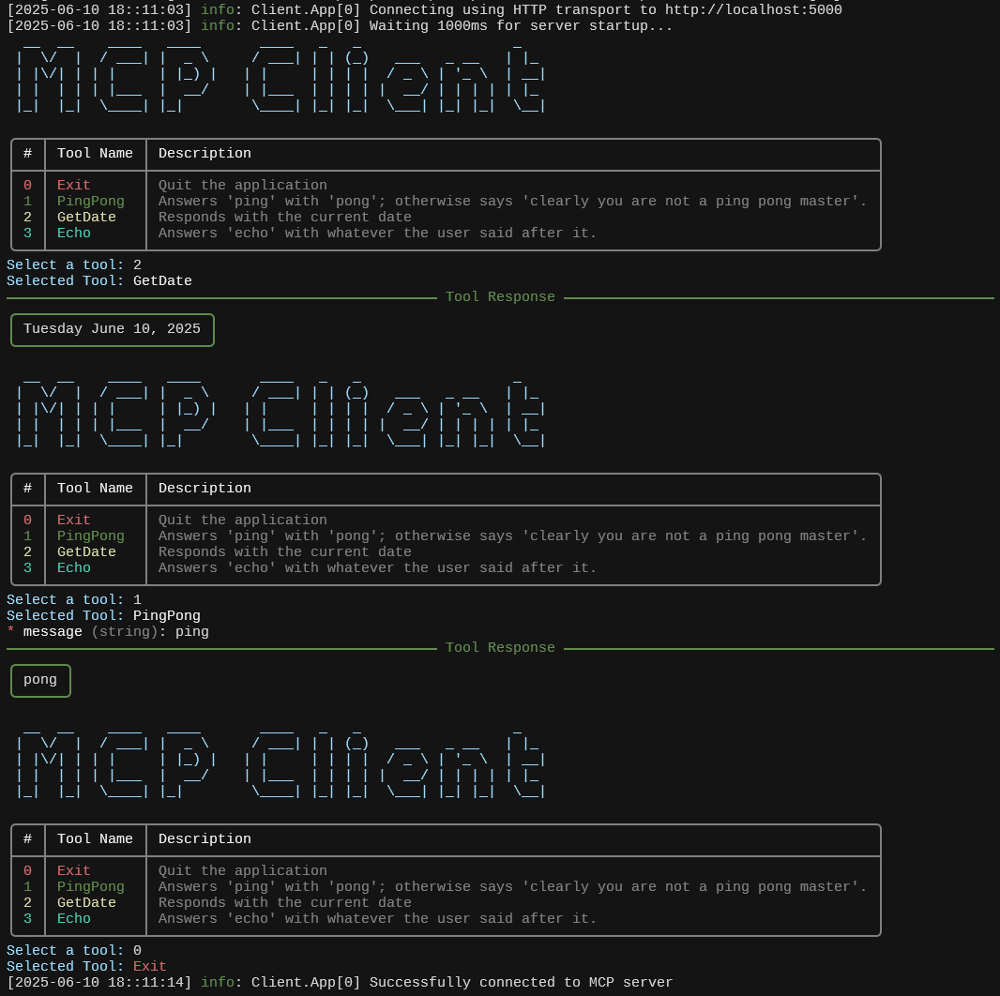

<div align="center">

# 🔗 MCP C# Template

[](https://dotnet.microsoft.com/) [](https://docs.microsoft.com/en-us/dotnet/csharp/) [](https://modelcontextprotocol.io/) [](https://opensource.org/licenses/MIT)

**🚀 Build powerful Model Context Protocol servers and clients in C# with .NET 9**

*Featuring stdio, HTTP, and SSE transport protocols • Enhanced console UI • Production-ready*

---

</div>

### 🌟 **Three Projects, Multiple Transports, Unlimited Possibilities**

| 🖥️ **StdioServer** | 🌐 **HttpServer** | 🎯 **Client** |
|:---:|:---:|:---:|
| Local Development | Remote Deployment | Universal Testing |
| Claude Desktop Ready | Scalable & Cloud-Native | Beautiful Console UI |
| Zero Configuration | Docker Compatible | Multi-Transport |

---

## ✨ Features

- 🎯 **StdioServer Project**: Standard I/O MCP server with example tools (`DateTool`, `EchoTool`, `PingPongTool`)
- 🌐 **HttpServer Project**: Modern HTTP server with Streamable HTTP and SSE fallback support
- 🎨 **Client Project**: Universal client with enhanced Spectre.Console interface supporting all transports
- 🔧 **Extensibility**: Add new tools effortlessly - they appear in both servers automatically
- 📦 **Production Ready**: Built on official Microsoft ModelContextProtocol packages
- 🚀 **Multiple Transports**: stdio, Streamable HTTP, and legacy SSE support

---

## Table of Contents

- [🔗 MCP C# Template](#-mcp-c-template)
    - [🌟 **Three Projects, Multiple Transports, Unlimited Possibilities**](#-three-projects-multiple-transports-unlimited-possibilities)
  - [✨ Features](#-features)
  - [Table of Contents](#table-of-contents)
  - [Features](#features)
  - [Architecture](#architecture)
  - [Getting Started](#getting-started)
    - [Prerequisites](#prerequisites)
    - [Running the StdioServer](#running-the-stdioserver)
      - [Using MCP Inspector](#using-mcp-inspector)
    - [Running the HttpServer](#running-the-httpserver)
      - [Using MCP Inspector](#using-mcp-inspector-1)
      - [Viewing Server Logs](#viewing-server-logs)
    - [Running the Client](#running-the-client)
      - [Quick Start with Launch Profiles](#quick-start-with-launch-profiles)
      - [Manual Configuration](#manual-configuration)
      - [Enhanced Console Experience](#enhanced-console-experience)
    - [Example Tools](#example-tools)
  - [Configuration](#configuration)
    - [GitHub Copilot in VS Code](#github-copilot-in-vs-code)
      - [Stdio](#stdio)
      - [Streamable HTTP](#streamable-http)
    - [Claude Desktop Configuration](#claude-desktop-configuration)
      - [For StdioServer (recommended)](#for-stdioserver-recommended)
      - [For HttpServer with SSE Proxy](#for-httpserver-with-sse-proxy)
  - [Development](#development)
    - [Project Structure](#project-structure)
    - [Adding New Tools](#adding-new-tools)
    - [Transport Protocols](#transport-protocols)
  - [Deployment](#deployment)
    - [StdioServer](#stdioserver)
    - [HttpServer](#httpserver)
  - [Package Information](#package-information)
  - [License](#license)
  - [Contributing](#contributing)
  - [Acknowledgments](#acknowledgments)

## Features

- **StdioServer Project**: A standard input/output MCP server that includes three example tools (`DateTool`, `EchoTool`, and `PingPongTool`) automatically exposed via stdio transport.
- **HttpServer Project**: A modern HTTP-based MCP server with streamable HTTP and Server-Sent Events (SSE) fallback support for remote deployment scenarios.
- **Client Project**: A versatile MCP client that connects to any MCP server (not limited to .NET) using multiple transport protocols (stdio, HTTP, SSE) with an enhanced console interface.
- **Extensibility**: Easily add new tools to either server or extend the client's capabilities.

## Architecture

The template includes four main projects:

- **StdioServer**: Standard I/O transport server for local development and integration
- **HttpServer**: HTTP/SSE transport server for remote deployment and web scenarios
- **Client**: Universal client supporting all transport types with command-line interface
- **Core**: Shared library containing common tools and utilities

## Getting Started

### Prerequisites

- .NET 9 SDK installed on your machine
- A code editor like Visual Studio 2022 or Visual Studio Code

### Running the StdioServer

The StdioServer project exposes tools via standard input/output, ideal for local development and AI client integration.

#### Using MCP Inspector

1. Navigate to the `src/StdioServer` directory
2. Run: `npx @modelcontextprotocol/inspector dotnet run`

```plaintext
Starting MCP inspector...
⚙️ Proxy server listening on port 6277
🔍 MCP Inspector is up and running at http://127.0.0.1:6274 🚀
```

3. Open your browser to the URL shown (e.g., http://127.0.0.1:6274)
4. Click "Connect" → "List Tools" → Select and run tools

[](files/mcp_inspector_stdio.png)

### Running the HttpServer

The HttpServer project provides HTTP-based MCP with SSE streaming support for remote deployment scenarios.

1. Navigate to the `src/HttpServer` directory
2. Run: `dotnet run`
3. Server will start on `http://localhost:5000` with MCP endpoint ready

The HttpServer supports:
- **Streamable HTTP**: Modern HTTP POST/GET with optional SSE streaming
- **Legacy SSE**: Full Server-Sent Events transport for older clients
- **Auto-detection**: Automatically handles both transport modes

#### Using MCP Inspector

1. Launch the MCP Inspector
2. Select `Streamable HTTP` as the Transport Type
3. Enter the URL: `http://localhost:5000`
4. Click "Connect" → "List Tools" → Select and run tools

[](files/mcp_inspector_http.png)

#### Viewing Server Logs

You can view the server logs in the console output where the HttpServer is running. It will display incoming requests, tool execution results, and any errors encountered.

```plaintext
# Some output omitted for clarity and brevity

[2025-06-10 17::58:09] info: Microsoft.Hosting.Lifetime[14] Now listening on: http://localhost:5000
[2025-06-10 17::58:09] info: Microsoft.Hosting.Lifetime[0] Application started. Press Ctrl+C to shut down.
[2025-06-10 17::58:09] info: Microsoft.Hosting.Lifetime[0] Hosting environment: Production
[2025-06-10 17::58:09] info: Microsoft.Hosting.Lifetime[0] Content root path: C:\krk\mcp\mcp-csharp-template\src\HttpServer
[2025-06-10 17::58:45] info: McpServer => method 'initialize' request handler called.
[2025-06-10 17::58:45] info: McpServer =>  Client (mcp-inspector) method 'initialize' request handler completed.
[2025-06-10 17::58:56] info: McpServer =>  Client (mcp-inspector) method 'tools/list' request handler called.
[2025-06-10 17::58:56] info: McpServer =>  Client (mcp-inspector) method 'tools/list' request handler completed.
[2025-06-10 17::58:58] info: McpServer =>  Client (mcp-inspector) method 'tools/call' request handler called.
[2025-06-10 17::58:58] info: McpServer =>  Client (mcp-inspector) method 'tools/call' request handler completed.
```

### Running the Client

The Client project features a modern console interface with Spectre.Console and supports multiple transport protocols.

#### Quick Start with Launch Profiles

Navigate to `src/Client` and use predefined profiles:

```bash
# Connect to StdioServer
dotnet run --launch-profile dotnet-stdio

# Connect to HttpServer (modern HTTP)
dotnet run --launch-profile http-modern

# Connect to HttpServer (legacy SSE)
dotnet run --launch-profile sse-legacy
```

#### Manual Configuration

The client supports various transport types through command-line arguments:

```bash
# .NET stdio server
dotnet run -- dotnet -n StdioServer -p "../StdioServer/StdioServer.csproj"

# HTTP server (modern streamable HTTP)
dotnet run -- http -n HttpServer -u "http://localhost:5000"

# SSE server (legacy compatibility)
dotnet run -- sse -n HttpServer -u "http://localhost:5000"

# NPM package server
dotnet run -- npx -n weather-server -p "@modelcontextprotocol/server-weather"

# Python server with uvx
dotnet run -- uvx -n filesystem -p "mcp-server-filesystem"
```

#### Enhanced Console Experience

The client now features:
- **Rich UI**: Powered by Spectre.Console with colors and styled output
- **Tool Selection**: Interactive numbered menu with descriptions
- **Input Validation**: Required vs optional parameter handling
- **Response Display**: Formatted output panels with proper styling

Example interaction:

[](files/client.png)

### Example Tools

The template includes three demonstration tools:

- **DateTool**: Returns the current date formatted as "dddd MMMM d, yyyy"
- **EchoTool**: Echoes back any input provided by the user
- **PingPongTool**: Responds with "pong" when "ping" is sent, otherwise returns "clearly you are not a ping pong master"

## Configuration

### GitHub Copilot in VS Code

Add to your VS Code `settings.json`:

#### Stdio

```json
{
  "mcp": {
    "mcpCSharpTemplateStdio": {
      "type": "stdio",
      "command": "dotnet",
      "args": [
        "run",
        "--project",
        "C:\\path\\to\\mcp-csharp-template\\src\\StdioServer\\StdioServer.csproj"
      ]
    }
  }
}
```

#### Streamable HTTP

```json
{
  "mcp": {
    "mcpCSharpTemplateHttp": {
      "type": "http",
      "url": "http://localhost:5000",
      "headers": {
        "VERSION": "1.0"
      }
    }
  }
}
```

### Claude Desktop Configuration

#### For StdioServer (recommended)

```json
{
  "mcpServers": {
    "mcpCSharpTemplate": {
      "type": "stdio",
      "command": "dotnet",
      "args": [
        "run",
        "--no-build",
        "--project",
        "C:\\path\\to\\mcp-csharp-template\\src\\StdioServer"
      ]
    }
  }
}
```

#### For HttpServer with SSE Proxy

Since Claude Desktop doesn't natively support HTTP/SSE, use a proxy:

```json
{
  "mcpServers": {
    "mcpCSharpHttp": {
      "command": "npx",
      "args": [
        "mcp-remote",
        "http://localhost:5000"
      ]
    }
  }
}
```

## Development

### Project Structure

```
├── src/
│   ├── Core/                 # Shared tools and utilities
│   ├── StdioServer/          # Standard I/O MCP server
│   ├── HttpServer/           # HTTP/SSE MCP server
│   └── Client/               # Universal MCP client
├── test/
│   └── Unit/                 # Unit tests for tools
└── Directory.Build.props     # Shared build configuration
```

### Adding New Tools

1. Create your tool in the `src/Core/Tools/` directory:

```csharp
[McpServerToolType]
public static class MyTool
{
    [McpServerTool]
    [Description("Description of what your tool does")]
    public static string MyMethod(string parameter) => $"Result: {parameter}";
}
```

2. Tools are automatically discovered and exposed by both servers

### Transport Protocols

The template supports multiple MCP transport protocols:

- **Stdio**: Standard input/output for local integration
- **Streamable HTTP**: Modern HTTP POST/GET with optional SSE streaming (MCP spec 2025-03-26)
- **Legacy SSE**: Full Server-Sent Events transport for backward compatibility

## Deployment

### StdioServer
- Best for local development and AI client integration
- No network configuration required
- Ideal for Claude Desktop, VS Code, and development tools

### HttpServer
- Deploy to cloud platforms (Azure App Service, AWS, etc.)
- Supports remote MCP scenarios
- Can be containerized with Docker
- Scales horizontally for multiple client connections

## Package Information

The template uses the official Microsoft ModelContextProtocol packages:

- `ModelContextProtocol` - Main package with hosting and dependency injection extensions
- `ModelContextProtocol.AspNetCore` - Library for HTTP-based MCP servers

This project is in preview; breaking changes can be introduced without prior notice.

## License

This project is licensed under the MIT License - see the [LICENSE](./LICENSE) file for details.

## Contributing

Contributions are welcome! Feel free to fork the repository and submit a pull request.

Repository: https://github.com/krk-architect/mcp-csharp-template

## Acknowledgments

- Microsoft's collaboration with Anthropic to create the official C# SDK for Model Context Protocol
- [Model Context Protocol](https://modelcontextprotocol.io/) - The open protocol specification
- The .NET community for their support and resources
